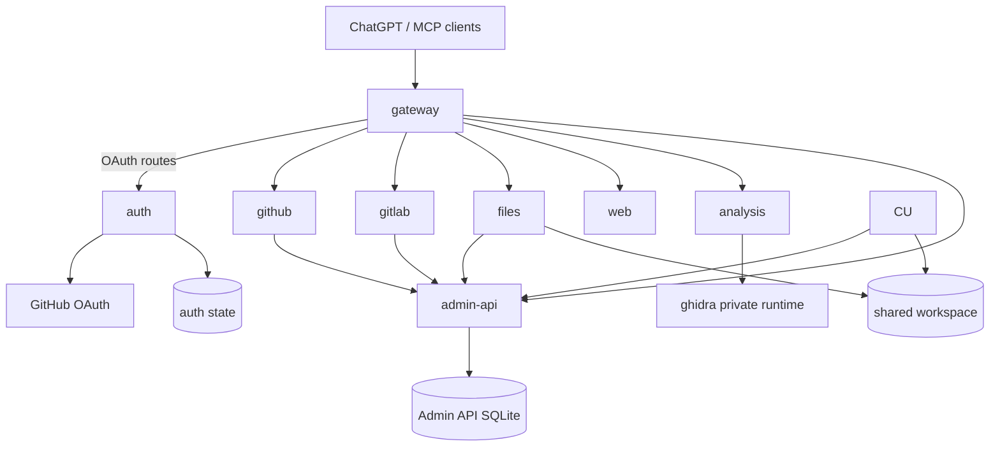

# Architecture overview

MCP Bridge separates authorization, public routing, Admin API and provider execution.



## Source ownership

- `auth_service` — OAuth authorization server, DCR, GitHub login, resource audiences
  and private token verification.
- `bridge` — public edge, MCP routing, protected-resource metadata, auth/admin-api reverse
  proxies.
- `common` — provider-neutral runtime contracts and typed settings.
- `admin-api` — provider account registry, encrypted credentials, session/API/realtime control plane and telemetry.
- `modules.github` — GitHub repository/review/actions capabilities.
- `modules.gitlab` — GitLab project/repository/CI capabilities.
- `modules.files` — path-based shared workspace file administration.
- `modules.web` — structured HTTP, persistent browser and DevTools operations.
- `modules.analysis` — public structured-analysis facade.
- `modules.ghidra` — private native backend adapter.

## OAuth model

Auth is one authorization server at `https://mcp.koba-nexus.ru`. Each public MCP URL is
an exact protected resource and access-token audience. Gateway publishes the RFC 9728
resource documents; auth publishes RFC 8414 metadata and OAuth operational endpoints.

Only auth stores GitHub OAuth credentials and FastMCP OAuth state. Gateway delegates
bearer verification to auth through an authenticated private API.

## Public surfaces

```text
/mcp
/github/mcp
/gitlab/mcp
/files/mcp
/web/mcp
/analysis/mcp
/admin
```

Raw Ghidra is private.

## Deployment isolation

Production uses one Coolify application per Docker target. Provider-only changes do not
restart auth, gateway or unrelated providers. Shared runtime/dependency changes may
intentionally redeploy multiple applications.

See `deploy/coolify/README.md`.
