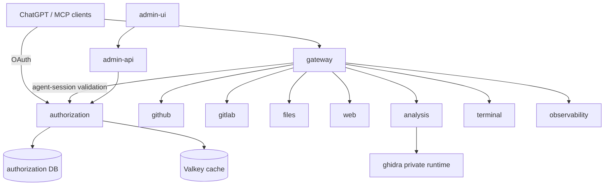

# Architecture overview

The source architecture separates external OAuth identity, agent access, public routing, administration and provider execution.



## Source ownership

- `authorization` — local users, OAuth/token state, JWT signing, agent sessions, access elevation, per-MCP controls, account scopes and access security history.
- `bridge` — public gateway, MCP routing, protected-resource metadata, local OAuth token verification and access enforcement middleware.
- `common` — provider-neutral contracts, stable MCP surface IDs and typed settings.
- `admin-api` — administration BFF/realtime surface; it does not own authorization persistence.
- `modules.github`, `modules.gitlab`, `modules.files`, `modules.web`, `modules.analysis`, `modules.terminal`, `modules.observability` — provider/domain runtimes.
- `modules.ghidra` — private native analysis backend adapter.

## OAuth model

The `authorization` runtime is the authorization server at `https://authorization.mcp.koba-nexus.ru`. Public MCP URLs remain under `https://mcp.koba-nexus.ru` and are exact protected resources/access-token audiences. Gateway publishes protected-resource metadata that points clients to the separate authorization-server URL; OAuth operational endpoints are served directly by authorization.

Authorization issues ES256 tokens. The private signing key remains in authorization; gateway verifies with the public key/JWKS.

## Agent access model

OAuth identifies the local user/client. Agent sessions independently decide whether a concrete agent context may execute against a concrete MCP surface.

The MVP has automatic read-only sessions and one elevated `full_access` level. Session state is durable in PostgreSQL, with Valkey as a read-through cache. Per-user/per-surface enforcement can be `unrestricted` or `session_enforced`.

See `docs/architecture/authorization-access.md`.

## Public surfaces

```text
/mcp
/github/mcp
/gitlab/mcp
/files/mcp
/web/mcp
/analysis/mcp
/terminal/mcp
/observability/mcp
```

Raw Ghidra is private.

## Deployment isolation

Production uses one Coolify application per Docker target. The legacy monolith stays pinned until split-runtime acceptance. Provider-only changes do not require authorization/gateway restarts unless their shared contract changes.

See `docs/deployment.md`.
